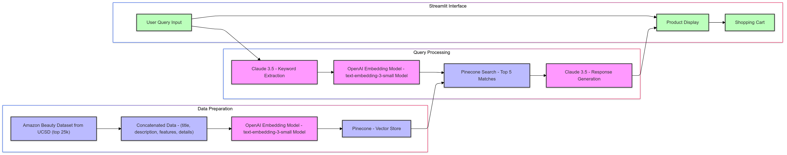

# AI Shopping Assistant

An intelligent RAG-Based shopping assistant powered by Anthropic's Claude 3.5 Sonnet, OpenAI's `text-embedding-3-small`, and Pinecone vector database that helps users find products through natural conversation and provides personalized recommendations.

## Demo

<!-- Choose one of these options based on your video format: -->


## Features

### 🤖 AI-Powered Search
- Natural language understanding for product searches
- Personalized shopping advice based on user needs
- Context-aware recommendations
- Vector similarity search for accurate product matching

### 📦 Smart Product Display
- Visual product galleries with main images and thumbnails
- Detailed product information including:
  - Prices and ratings
  - Product features
  - Technical specifications
  - Seller information
- Expandable sections for additional details

### 🛒 Shopping Cart Management
- Real-time cart updates
- Running total calculation
- Easy cart management
- Clear cart functionality

## Technical Architecture



## Installation

1. Clone the repository:
```bash
git clone git@github.com:shwetha-krishnamurthy/generative_ai_final_project.git
cd generative_ai_final_project
```

2. Install required packages:
```bash
pip install -r requirements.txt
```

3. Set up environment variables:
```bash
export ANTHROPIC_API_KEY=your_api_key_here
export PINECONE_API_KEY=your_api_key_here
export OPENAI_API_KEY=your_api_key_here
```

4. Run the application:
```bash
streamlit run app.py
```

## Usage

1. **Starting a Search**
   - Enter your product requirements in natural language
   - The AI assistant will analyze your needs and search for relevant products

2. **Browsing Products**
   - Review the AI's shopping advice
   - Browse through product cards
   - Expand sections for more details
   - View product images

3. **Managing Cart**
   - Add products to cart with one click
   - Review cart contents in the sidebar
   - Clear cart as needed
   - View running total

## Contributing

1. Fork the repository
2. Create a feature branch
3. Commit your changes
4. Push to the branch
5. Create a Pull Request

## License

This project is licensed under the MIT License - see the LICENSE file for details.
